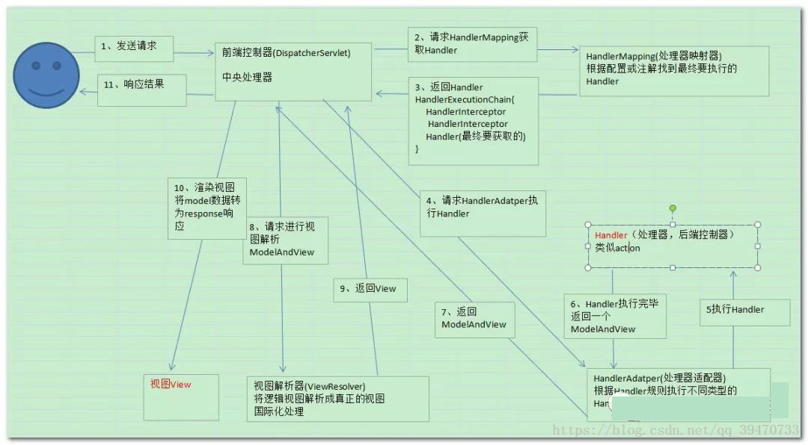

####SpringMVC 简易实现

##### SpringMVC 工作流程图

##### 组件说明
- DispatcherServlet：前端控制器，也称为中央控制器，它是整个请求响应的控制中心，组件的调用由它统一调度。
- HandlerMapping：处理器映射器，它根据用户访问的 URL 映射到对应的后端处理器 Handler。也就是说它知道处理用户请求的后端处理器，但是它并不执行后端处理器，而是将处理器告诉给中央处理器。
- HandlerAdapter：处理器适配器，它调用后端处理器中的方法，返回逻辑视图 ModelAndView 对象。
- ViewResolver：视图解析器，将 ModelAndView 逻辑视图解析为具体的视图（如 JSP）。
- Handler：后端处理器，对用户具体请求进行处理，也就是我们编写的 Controller 类。

参考：https://blog.csdn.net/qq_36571671/article/details/93142719